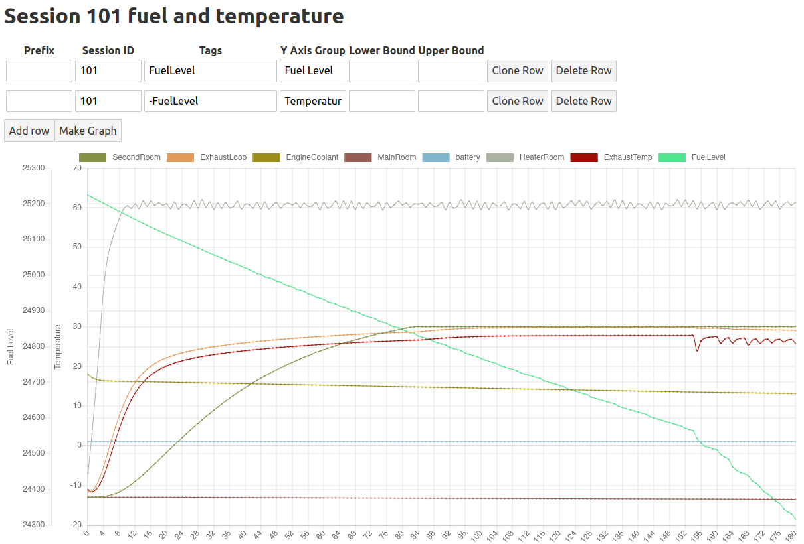

# Installation

This app requires [Python 3](https://www.python.org/downloads/) installed to run. 

If using the Python installer on Windows, make sure the `Add Python 3.xx to path` option is ticked on the installer

Once Python is installed. Open a terminal/command prompt and navigate to the folder containing this README.

run the command: `pip install -r requirements.txt`

# Usage

To run the server for services on the local machine only run the following command 
`uvicorn main:app`

If you want to be able to access the server from your local network, run
`uvicorn main:app --host '0.0.0.0'`

## Adding data points 

To make this app as compatible as possible, data points are added using GET parameters. The most basic way to add a data point is by making a request to the add endpoint including `tag` and `value` parameters.

For example making a request to http://localhost:8000/add?tag=Temperature&value=18 will add those details to the database and respond with a single integer representing the `session_id`

You can make a note of this `session_id` for recovering this data later. `session_id` is incremented by default after 10 seconds without any requests made to the `/add` endpoint. The `session_id` can also be forced by adding it to the `/add` request e.g. http://localhost:8000/add?tag=Temperature&value=18&session_id=100

## Making charts

The chart dashboard can be found at http://localhost:8000

The simplest way to build a chart is to click the **New Graph** button, add the `session_id` to the **Session ID** cell, and click the **Make Graph** button. The graph title can be changed by simply clicking on it and it becomes editable.

You will likely want more control over charts though, so there are several options to help.

To include only certain tags, you can add those tags as comma seperated inputs eg. by adding `IndoorTemp,OutdoorTemp` to the **Tags** column you will only show those values. You can also choose to add all except certain tags by using a minus sign. eg. `-IndoorTemp,-OutdoorTemp`

To make graphs more readable, it's possible to set labels in the **Y Axis Group** column. All rows with the same value in the **Y Axis Group** column will share the same axis and the axis will be scaled to the min/max value of all values on that axis.

Using all these options together allows to make intricate graphs with a few simple inputs. For example the following graph is from some experiments I performed in Stormworks. The first row is set to only use the `FuelLevel` tag and has it's **Y Axis Group** set to `Fuel Level`, while the rest of the data which is all logged in degrees celsius is made available by adding in the second row `-FuelLevel` for the **Tags** and `Temperature` for the **Y Axis Group**

## Further documentation

Further API documentation can be found at http://localhost:8000/docs
A video demonstration of this software in use can be found at https://youtu.be/Tpuqa-kPnOA?si=8_orNm2klPP7aKHF&t=201
