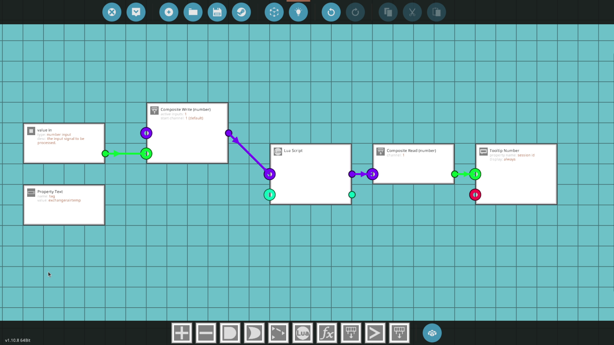

Stormworks wont let me upload the microcontroller to the workshop without an output. To add this microcontroller to your game, copy the design from the screenshot, then open the lua script and paste the text from `stormworks-tiny-logger`

